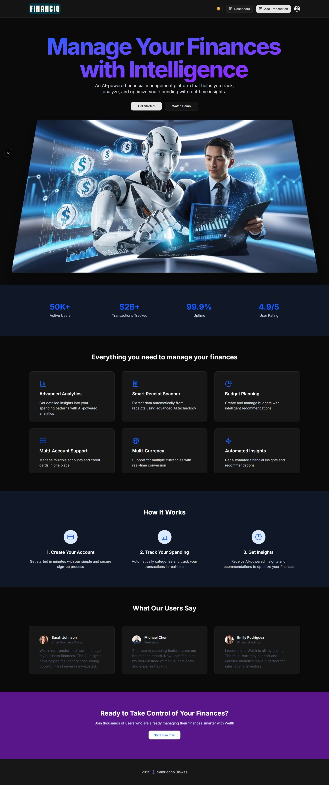

# Financio

**Financio** is an AI-powered financial management platform that helps you track, analyze, and optimize your spending with real-time insights. Built with [Next.js](https://nextjs.org), Prisma, Clerk authentication, and Tailwind CSS, Financio provides a modern, responsive, and secure experience for managing your finances.

---

## Features

- **AI-Powered Analytics:** Get detailed insights into your spending patterns.
- **Smart Receipt Scanner:** Extract data automatically from receipts using advanced AI technology.
- **Budget Planning:** Create and manage budgets with intelligent recommendations.
- **Multi-Account Support:** Manage multiple accounts and credit cards in one place.
- **Multi-Currency:** Support for multiple currencies with real-time conversion.
- **Automated Insights:** Receive automated financial insights and recommendations.
- **User Authentication:** Secure sign-up, login, and user management with Clerk.
- **Theme Toggle:** Switch between light and dark mode for a personalized experience.
- **Responsive Design:** Fully responsive UI for desktop and mobile devices.

---

## Getting Started

### 1. Clone the repository

```bash
git clone https://github.com/your-username/financio.git
cd financio
```

### 2. Install dependencies

```bash
npm install
# or
yarn install
```

### 3. Set up environment variables

Create a `.env` file in the root directory and add the following (update with your own values):

```env
DATABASE_URL=your_postgres_connection_string
DIRECT_URL=your_postgres_direct_connection_string
NEXT_PUBLIC_CLERK_PUBLISHABLE_KEY=your_clerk_publishable_key
CLERK_SECRET_KEY=your_clerk_secret_key
```

### 4. Set up the database

Run Prisma migrations and generate the client:

```bash
npx prisma migrate dev --name init
npx prisma generate
```

### 5. Run the development server

```bash
npm run dev
# or
yarn dev
```

Open [http://localhost:3000](http://localhost:3000) in your browser to see the app.

---

## Project Structure

```
├── app/                # Next.js app directory (pages, layouts, etc.)
├── components/         # Reusable React components (Header, Hero, ThemeToggle, etc.)
├── lib/                # Utility libraries (Prisma client, user helpers)
├── prisma/             # Prisma schema and migrations
├── public/             # Static assets (logo.png, images)
├── styles/             # Global and component styles
├── tailwind.config.js  # Tailwind CSS configuration
└── package.json        # Project metadata and scripts
```

---

## Scripts

- `npm run dev` – Start the development server
- `npm run build` – Build for production
- `npm run start` – Start the production server
- `npx prisma migrate dev` – Run database migrations
- `npx prisma generate` – Generate Prisma client

---

## Technologies Used

- [Next.js](https://nextjs.org/)
- [React](https://react.dev/)
- [Prisma](https://www.prisma.io/)
- [PostgreSQL](https://www.postgresql.org/)
- [Clerk](https://clerk.com/) (Authentication)
- [Tailwind CSS](https://tailwindcss.com/)
- [next-themes](https://github.com/pacocoursey/next-themes) (Theme toggle)
- [Lucide React](https://lucide.dev/) (Icons)

---

## Customization

- **Logo:** Place your `logo.png` in the `public/` directory to update the branding.
- **Theme:** Easily toggle between light and dark mode using the theme switcher in the header.
- **Database:** Update your Prisma schema in `prisma/schema.prisma` as needed and run migrations.

---

## Learn More

- [Next.js Documentation](https://nextjs.org/docs)
- [Prisma Documentation](https://www.prisma.io/docs/)
- [Clerk Documentation](https://clerk.com/docs)
- [Tailwind CSS Documentation](https://tailwindcss.com/docs)

---

## License

This project is licensed under the MIT License.

---

**2025 ©️ Samriddho Biswas**


